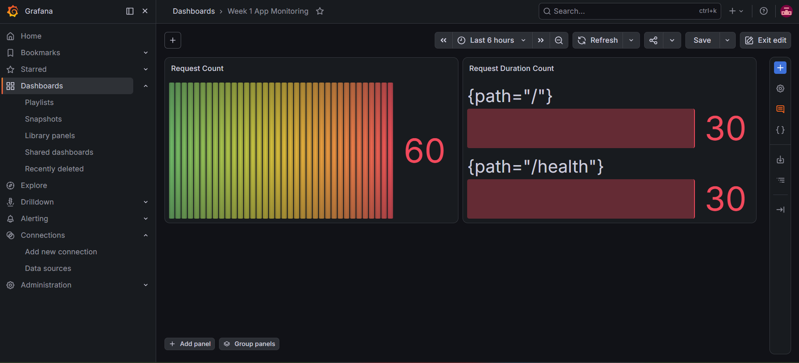
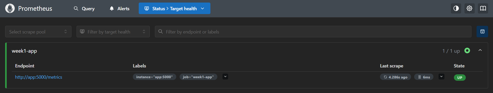

# Week 1 DevOps Project

A hands-on DevOps & Platform Engineering project demonstrating containerization, CI/CD automation, and application monitoring using industry-standard tools.

## 📋 Overview

This project implements a simple Flask web application and builds a complete DevOps pipeline around it, covering:

- **Containerization** — Packaging the application with Docker for consistent, portable deployment
- **CI/CD Pipeline** — Automated testing and image building on every push using GitHub Actions
- **Monitoring & Observability** — Application metrics exposed via Prometheus and visualized in Grafana

## 🏗️ Architecture

┌─────────────┐ ┌──────────────┐ ┌─────────────┐
│ Flask App │─────▶│ Prometheus │─────▶│ Grafana │
│ (port 5000) │ │ (port 9090) │ │ (port 3000) │
└─────────────┘ └──────────────┘ └─────────────┘
│
▼
┌─────────────────────┐
│ GitHub Actions │
│ (Test → Build CI) │
└─────────────────────┘


## 🛠️ Tech Stack

| Category | Tool |
|---|---|
| Language | Python 3.11 |
| Web Framework | Flask |
| Containerization | Docker, Docker Compose |
| CI/CD | GitHub Actions |
| Testing | Pytest |
| Monitoring | Prometheus, Grafana |
| Metrics Export | prometheus-flask-exporter |

## 📁 Project Structure

DevOps-Project/
├── app.py # Main Flask application
├── requirements.txt # Python dependencies
├── Dockerfile # Container build instructions
├── docker-compose.yml # Multi-container orchestration (app + Prometheus + Grafana)
├── prometheus.yml # Prometheus scrape configuration
├── pytest.ini # Pytest configuration
├── .dockerignore
├── .gitignore
├── tests/
│ └── test_app.py # Unit tests
└── .github/
└── workflows/
└── ci.yml # CI/CD pipeline definition


## 🚀 Getting Started

### Prerequisites
- Python 3.10+
- Docker Desktop
- Git

### Local Setup (without Docker)

```bash
# Clone the repository
git clone https://github.com/MODRIC1009/devops-project
cd week1-devops-project

# Create and activate a virtual environment
python -m venv venv
venv\Scripts\activate      # Windows
source venv/bin/activate   # Mac/Linux

# Install dependencies
pip install -r requirements.txt

# Run the application
python app.py
```

The app will be available at `http://localhost:5000`

### Running Tests

```bash
pytest
```

### Running with Docker

```bash
# Build the image
docker build -t week1-app .

# Run the container
docker run -p 5000:5000 week1-app
```

### Running the Full Stack (App + Monitoring)

```bash
docker-compose up
```

This starts three services:
- **App** → `http://localhost:5000`
- **Prometheus** → `http://localhost:9090`
- **Grafana** → `http://localhost:3000` (default login: `admin` / `admin`)

## 🔌 API Endpoints

| Endpoint | Description |
|---|---|
| `GET /` | Welcome message |
| `GET /health` | Health check endpoint |
| `GET /metrics` | Prometheus metrics endpoint |

## 🔄 CI/CD Pipeline

Every push to the `main` branch automatically triggers a GitHub Actions workflow that:
1. Checks out the code
2. Sets up the Python environment
3. Installs dependencies
4. Runs the test suite
5. Builds the Docker image

View pipeline runs under the [Actions](../../actions) tab.

## 📊 Monitoring

The application exposes a `/metrics` endpoint using `prometheus-flask-exporter`. Prometheus scrapes this endpoint every 5 seconds, and Grafana visualizes:

- Request count
- Request latency
- Error rate

## 📸 Proof of Working Setup

### Grafana Dashboard — Live Metrics


### Prometheus Target Health


## 📝 Notes

This project was built as part of a Week 1 DevOps & Platform Engineering learning plan, covering Linux fundamentals, cloud infrastructure concepts, containerization, CI/CD, and monitoring/observability principles.

## 👤 Author

**Nihal Lopez**
